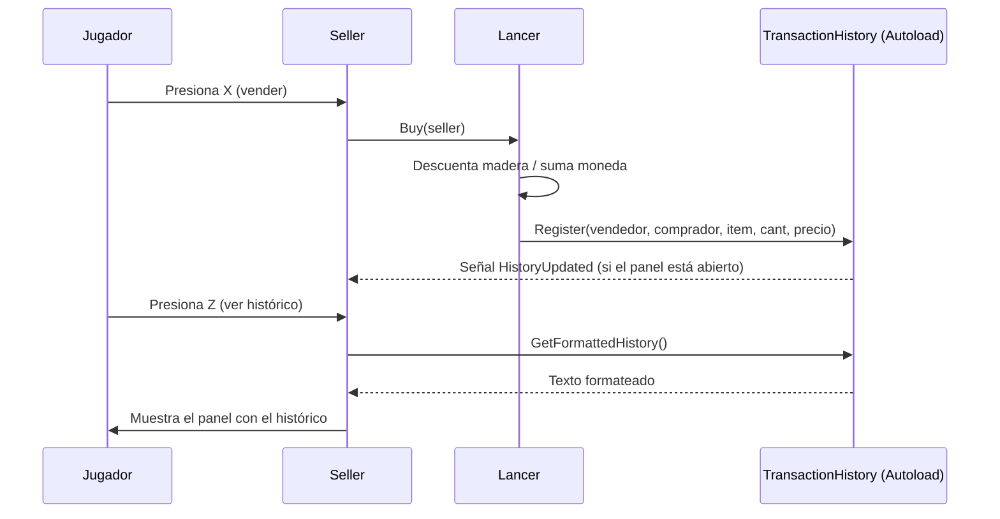

# Arquitectura — Sistema de Histórico de Interacciones

Este documento explica en detalle **cómo** está construido el sistema de
histórico y **por qué** se tomaron esas decisiones de diseño.

## 1. Objetivo del sistema

Registrar y mostrar, en cualquier momento, todas las interacciones de venta
entre el Vendedor y los NPCs, sin acoplar fuertemente los scripts entre sí.

## 2. Componentes

### 2.1 `Transaction` (Systems/Transaction.cs)

Modelo de datos **inmutable** que representa un único registro de
interacción.

```csharp
public sealed class Transaction
{
    public string SellerName { get; }
    public string BuyerName { get; }
    public string ItemName { get; }
    public int Quantity { get; }
    public int Price { get; }
    public string CurrencyName { get; }

    public override string ToString() { /* formatea el texto final */ }
}
```

No expone setters públicos: una vez construido, el registro no puede
alterarse. Esto asegura la integridad del histórico.

### 2.2 `TransactionHistory` (Systems/TransactionHistory.cs)

Singleton implementado como **Autoload** de Godot. Es el único punto de
verdad sobre las interacciones ocurridas.

Responsabilidades:

- Mantener la lista de `Transaction` (`IReadOnlyList<Transaction>` hacia
  afuera, para evitar modificaciones externas no controladas).
- Exponer `Register(...)` para agregar un nuevo registro.
- Emitir la señal `HistoryUpdated` cada vez que se agrega un registro.
- Formatear el histórico completo como texto (`GetFormattedHistory()`),
  listo para pintarse en la UI.

Registrado en `project.godot`:

```
[autoload]
TransactionHistory="*res://Systems/TransactionHistory.cs"
```

### 2.3 `Lancer` (Characters/Lancer.cs)

Al concretar una venta (`Buy(Seller seller)`), descuenta madera, aumenta
monedas y notifica al histórico:

```csharp
TransactionHistory.Instance?.Register(
    sellerName: seller.DisplayName,
    buyerName: DisplayName,
    itemName: "tronco",
    quantity: 1,
    price: 1);
```

### 2.4 `Seller` (Characters/Seller.cs)

- Mantiene la referencia al panel visual del histórico (`HistoryPanel` /
  `HistoryLabel`, definidos en `seller.tscn`).
- Se suscribe a `TransactionHistory.Instance.HistoryUpdated` para refrescar
  el texto automáticamente si el panel está abierto.
- Alterna la visibilidad del panel al presionar la acción `show_resume`
  (tecla `Z`), y carga el texto formateado del histórico al abrirlo.

## 3. Diagrama de flujo



## 4. Decisiones de diseño y alternativas consideradas

| Decisión | Alternativa descartada | Motivo |
|----------|------------------------|--------|
| Autoload/Singleton para el histórico | Pasar una referencia manual desde `World` a cada NPC y al Vendedor | Evita acoplar la jerarquía de nodos; cualquier NPC nuevo puede registrar ventas sin cambiar `World.tscn` |
| `Transaction` inmutable | Clase con setters públicos | Garantiza que un registro histórico no pueda alterarse después de creado |
| Señal (`HistoryUpdated`) en vez de refrescar el texto en cada `_Process` | Actualizar el `RichTextLabel` cada fotograma | Más eficiente; solo se recalcula el texto cuando realmente cambia algo |
| `IReadOnlyList<Transaction>` como colección expuesta | Exponer directamente el `List<Transaction>` | Evita que código externo agregue o elimine registros sin pasar por `Register(...)` |

## 5. Extensiones futuras sugeridas

- Agregar lógica de venta (`Buy`) a `Goblin` y `Monk`, reutilizando
  `TransactionHistory.Instance.Register(...)`.
- Persistir el histórico en disco (JSON) para que sobreviva entre partidas.
- Agregar marca de tiempo (`DateTime`) a cada `Transaction`.
- Filtrar el histórico por NPC o por tipo de ítem.
